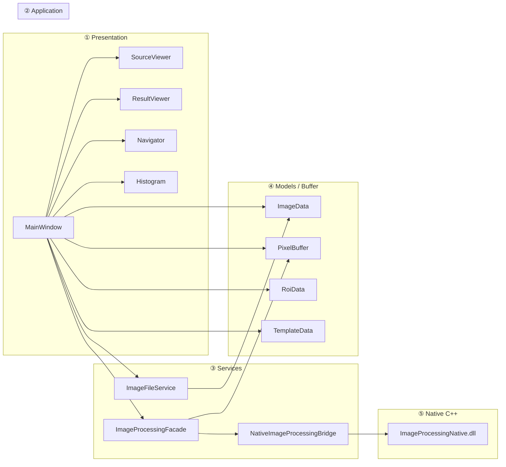
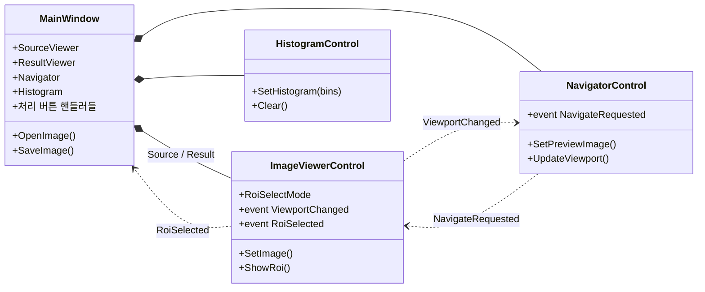
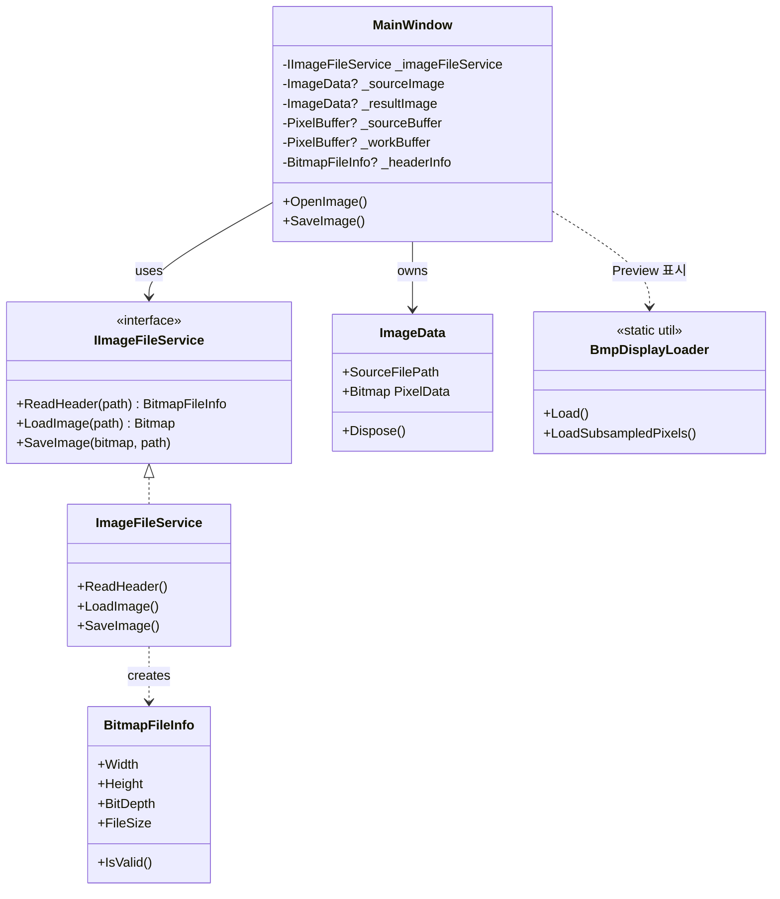
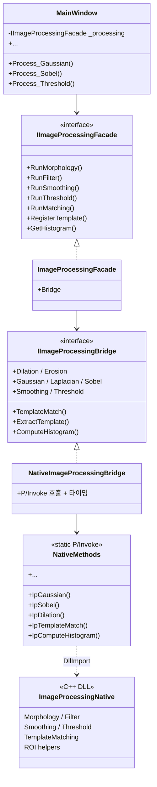
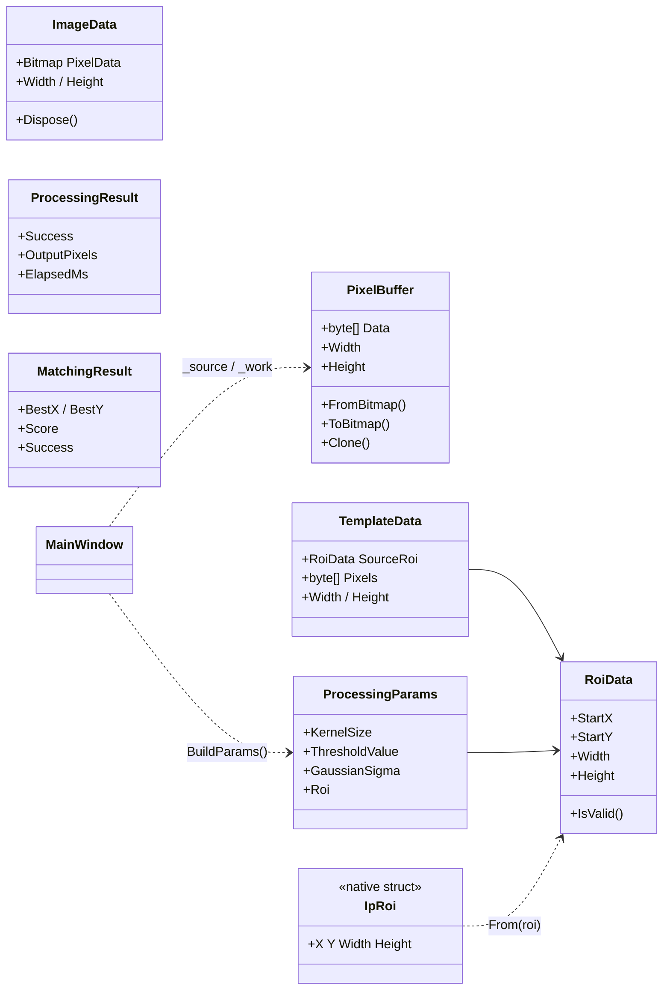
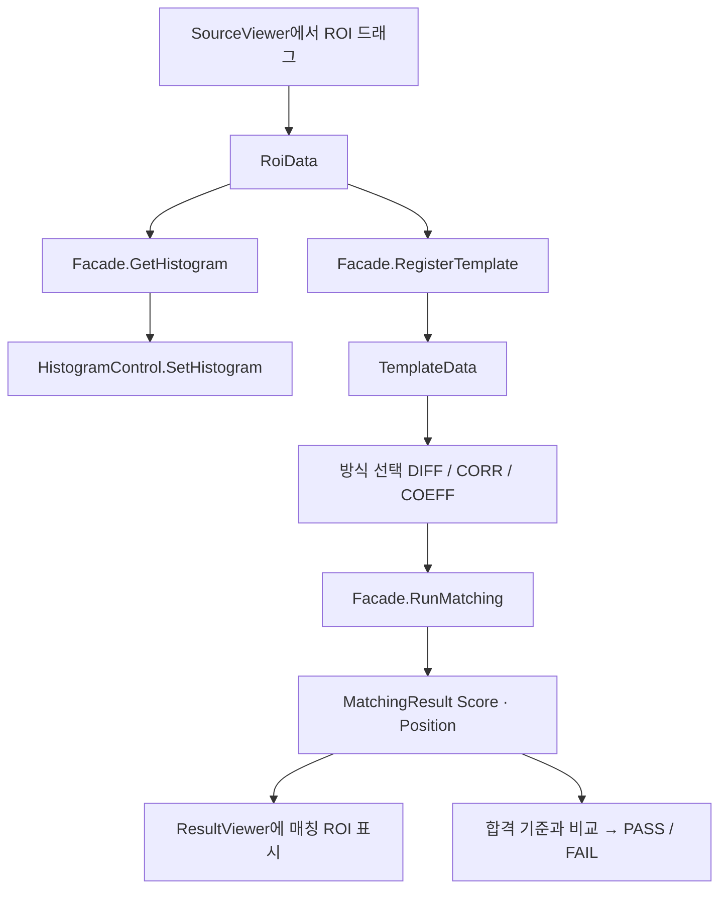
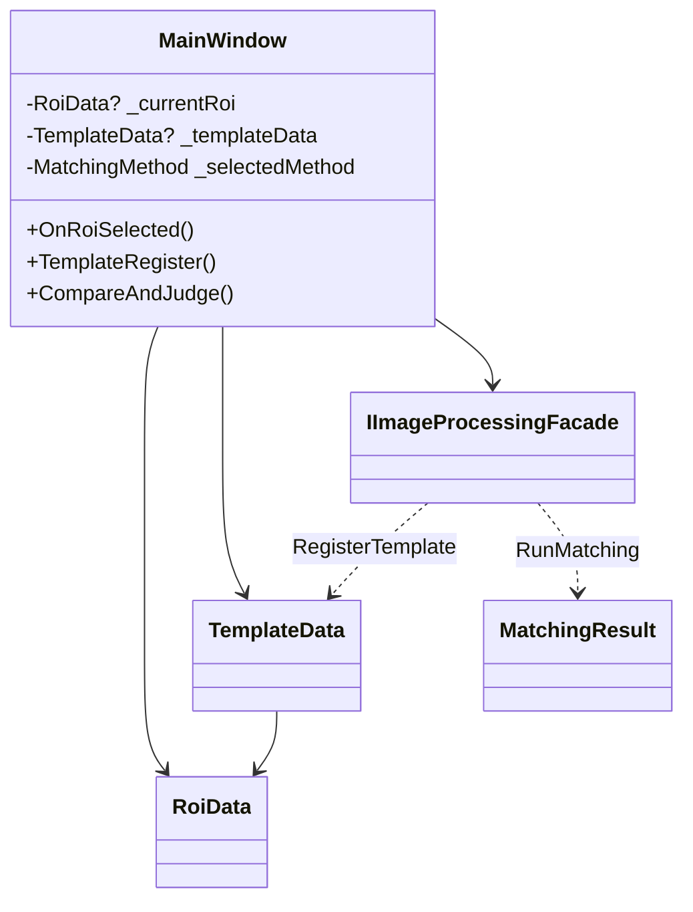

# ImageProgram — 발표용 클래스 다이어그램

> 현재 코드 기준. **한 장 = 한 메시지**. 슬라이드에는 다이어그램만 넣고, 아래 한 줄 설명을 자막으로 쓰면 됩니다.  
> Mermaid는 GitHub / Notion / VS Code / [mermaid.live](https://mermaid.live) 에서 이미지로보내기 가능합니다.

---

## 0. 한눈에 보기 — 계층 흐름

**메시지:** UI는 Facade만 보고, 알고리즘은 C++ DLL에만 있다.



```text
사용자 조작 → MainWindow → Facade → Bridge(P/Invoke) → C++ DLL
                              ↘ ImageFileService → BMP 파일
결과 표시 ← Viewer / Histogram / Navigator ← MainWindow
```

---

## 1. UI 구성 (화면이 어떻게 나뉘는가)

**메시지:** MainWindow가 컨트롤을 조립하고, Viewer가 ROI·뷰포트를 만든다.



| 컨트롤 | 역할 (한 줄) |
|--------|-------------|
| SourceViewer | 원본 표시 + ROI 드래그 |
| ResultViewer | 처리/매칭 결과 표시 |
| Navigator | 전체 위치 미니맵 |
| Histogram | ROI 밝기 분포 |

---

## 2. 파일 열기 / 저장

**메시지:** 헤더만 먼저 읽고, 대용량은 Preview 버퍼로 처리한다.



```text
Open 흐름
  ReadHeader → (작으면) LoadImage + PixelBuffer
             → (크면)  Subsample Preview → PixelBuffer
  → Viewer / Navigator 갱신
```

---

## 3. 영상처리 파이프라인 (핵심)

**메시지:** MainWindow → Facade → Bridge → NativeMethods → DLL. UI는 C++를 모른다.



### 연산 그룹 (발표용 박스)

| 그룹 | C# 진입 | C++ API 예 |
|------|---------|------------|
| Morphology | `RunMorphology` | `IpDilation`, `IpErosion` |
| Filter | `RunFilter` | `IpGaussian`, `IpLaplacian`, `IpSobel` |
| Smoothing / Threshold | `RunSmoothing` / `RunThreshold` | `IpSmoothing`, `IpThreshold` |
| Matching | `RunMatching` | `IpTemplateMatch` |
| ROI / Hist | `RegisterTemplate` / `GetHistogram` | `IpExtractRoi`, `IpComputeHistogram` |

---

## 4. 데이터 모델 (버퍼가 어떻게 흐르는가)

**메시지:** 표시용 Bitmap과 연산용 Gray8 PixelBuffer를 분리한다.



```text
표시: Bitmap / BitmapSource  →  Viewer
연산: PixelBuffer (Gray8)    →  C++ DLL
ROI:  RoiData                →  IpRoi (마샬링)
```

---

## 5. ROI → Histogram → Template Matching (기능 흐름)

**메시지:** 같은 ROI가 Histogram과 Template의 입력이 된다.





---

## 6. 슬라이드 배치 추천

| 슬라이드 | 쓸 다이어그램 | 말할 한 문장 |
|----------|---------------|--------------|
| 아키텍처 개요 | **§0 계층 흐름** | UI / Service / Native를 나눠 교체·확장이 쉽다 |
| UI | **§1** | 원본·결과 Viewer + Navigator + Histogram |
| 파일 I/O | **§2** | 헤더 선판독 + 대용량 Preview |
| 처리 구조 | **§3** | Facade가 UI와 C++ 사이를 막는다 |
| 데이터 | **§4** | 표시 Bitmap ≠ 연산 PixelBuffer |
| 검사 시나리오 | **§5** | ROI → Template → Match → 판정 |

---

## 7. 의존성 방향 (한 줄 요약)

```text
Controls / MainWindow
        ↓
  ImageProcessingFacade  ·  ImageFileService  ·  Models
        ↓
  NativeImageProcessingBridge
        ↓
  NativeMethods  (P/Invoke)
        ↓
  ImageProcessingNative.dll  (C++)
```

하위(C++)는 상위(UI)를 모른다. 알고리즘 추가는 DLL/`*.cpp`에만 하면 된다.
