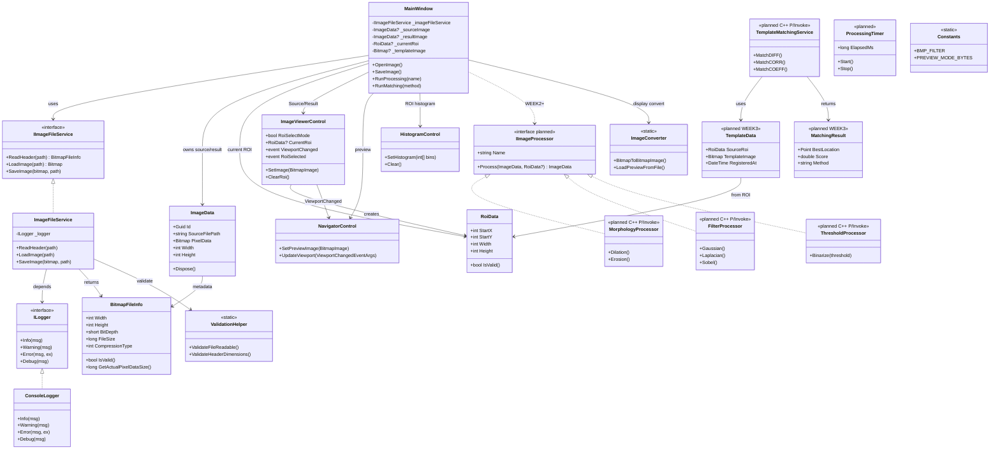

# 클래스 구조 다이어그램 (WEEK 1 설계)

> 설계 의도: **UI / 도메인 / I/O / 향후 영상처리(C++)** 를 계층으로 분리하여  
> 반도체 검사 SW의 `Acquisition → Processing → Result Display` 흐름과 대응시킨다.

---

## 1. 계층 구조 (왜 이렇게 나누었는가?)

| 계층 | 역할 | 실제 장비 SW 대응 |
|------|------|-------------------|
| **Presentation** | 화면 표시, 사용자 입력 | HMI / GUI |
| **Application (MainWindow)** | 화면 간 오케스트레이션 | Inspection Sequence |
| **Services** | 파일 I/O, 로깅 (교체 가능) | Camera SDK / File Loader |
| **Models** | 순수 데이터 (상태) | Image Buffer / ROI / Template |
| **Processing (예정)** | 알고리즘 (C++ DLL) | Inspection Algorithm |
| **Utils** | 변환·검증·상수 | Common Utility |

---

## 2. 전체 클래스 다이어그램



---

## 3. 핵심 설계 원칙 (발표 설명용)

### ① Interface 분리 (`IImageFileService`, `ILogger`)
- 구현을 교체해도 UI 코드는 안 바뀜
- 예: WEEK 1 = BMP / WEEK 4 = TIFF 추가 시 `TiffImageFileService` 만 추가

### ② 원본 / 결과 이미지 분리 (`_sourceImage` vs `_resultImage`)
```text
Camera(원본) → Processing → Inspection Result(결과)
     ↑                              ↑
 Image Viewer 1              Image Viewer 2
```
검사 장비 SW와 동일한 비교 패턴

### ③ ROI는 Model로 독립 (`RoiData`)
- Viewer는 “그리는 역할”만
- Histogram / Template / Matching은 같은 `RoiData`를 공유
- **UI 좌표 ≠ 이미지 좌표** 문제를 WEEK 2에서 여기서 해결

### ④ Processing은 UI와 강하게 결합하지 않음
- WEEK 2~3: `IImageProcessor` + **C++ DLL (P/Invoke)**
- MainWindow는 `RunProcessing("Gaussian")` 만 호출
- 알고리즘 수식/구현은 Processing 계층에만 존재 → 과제 조건(C++ 구현) 충족

### ⑤ 대용량 BMP 대응
- `ReadHeader()` : 메타데이터만 (5.6GB도 OK)
- `LoadPreviewFromFile()` : 화면 표시용 다운샘플
- 전체 로드는 메모리 허용 시에만 → 장비 SW의 Tile/Preview 전략과 유사

---

## 4. 주차별 확장 맵

```text
WEEK 1 (현재)
  MainWindow + Controls + ImageFileService + Models

WEEK 2 (골격 완료)
  + ImageProcessingNative (C++ DLL, 연산 스텁)
  + NativeMethods / PixelBuffer (P/Invoke)
  + IImageProcessingBridge + ImageProcessingFacade
  + Morphology / Filter / Threshold / Matching / ROI API 경로

WEEK 3
  + C++ 연산 본체 (팽창·수축·평활화·이진화·필터·매칭)
  + ROI Histogram 실데이터 / Preview 타일 처리

WEEK 4
  + 성능 최적화 / 예외 강화 / 통합 테스트
```

---

## 5. 의존성 방향 (중요)

```text
Controls / MainWindow
        ↓
    ImageProcessingFacade / Models
        ↓
    NativeImageProcessingBridge (P/Invoke)
        ↓
    ImageProcessingNative.dll (C++)
```

**하위 계층이 상위(UI)를 몰라야 한다.**  
알고리즘 추가는 `ImageProcessingNative/src/*.cpp` 에만 하면 됨.
