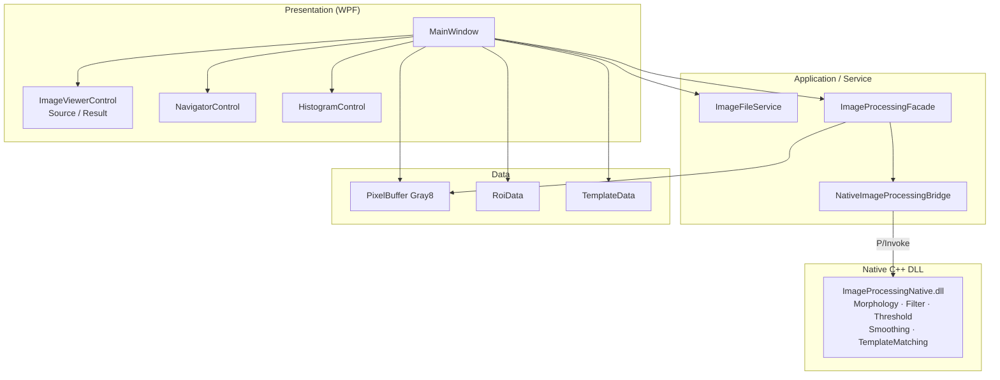
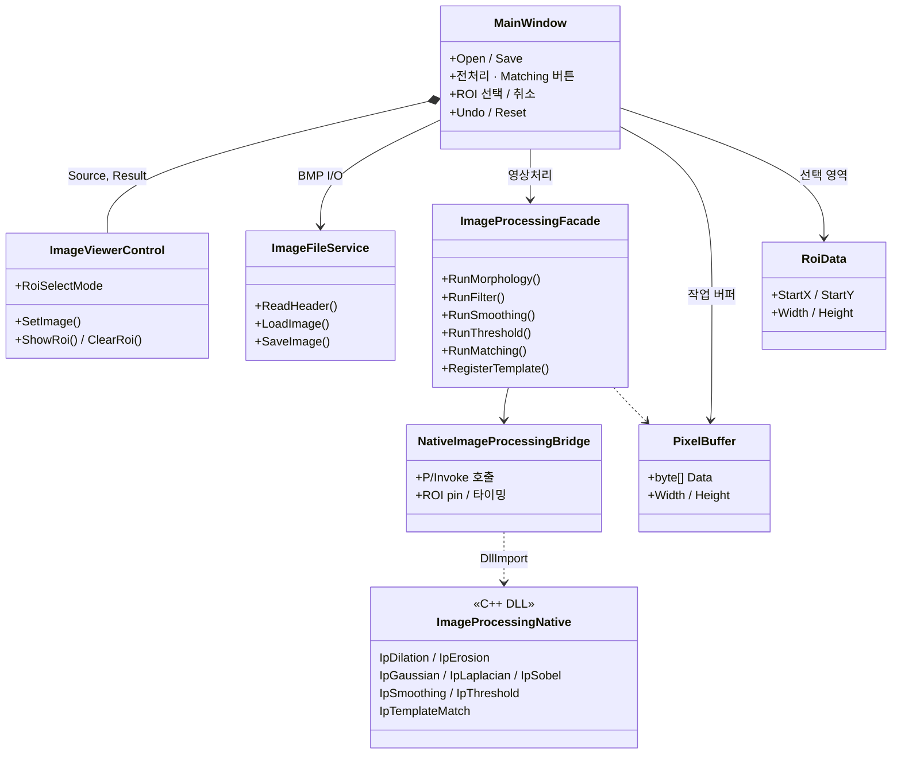
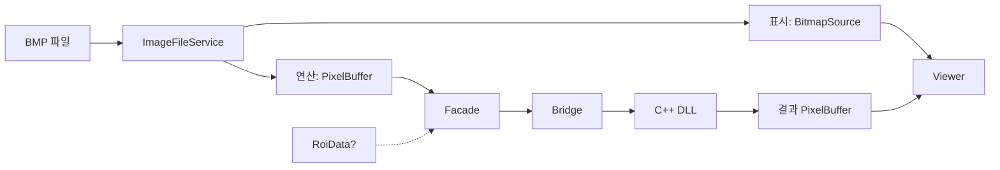

# ImageProgram — 최종 발표용 시스템 아키텍처

> **한 장 = 한 메시지.** 슬라이드에는 다이어그램만, 설명은 아래 한 줄만 쓰면 됩니다.  
> Mermaid → [mermaid.live](https://mermaid.live) 에서 PNG/SVG로 내보내기.

---

## 1. 시스템 아키텍처 (계층)

**메시지:** UI는 Facade만 보고, 실제 알고리즘은 C++ DLL에만 있다.


```mermaid
flowchart TB
    subgraph UI["Presentation (WPF)"]
        MW[MainWindow]
        V[ImageViewerControl<br/>Source / Result]
        N[NavigatorControl]
        H[HistogramControl]
    end

    subgraph SVC["Application / Service"]
        FS[ImageFileService]
        FAC[ImageProcessingFacade]
        BR[NativeImageProcessingBridge]
    end

    subgraph DATA["Data"]
        PB[PixelBuffer Gray8]
        ROI[RoiData]
        TPL[TemplateData]
    end

    subgraph NATIVE["Native C++ DLL"]
        DLL[ImageProcessingNative.dll<br/>Morphology · Filter · Threshold<br/>Smoothing · TemplateMatching]
    end

    MW --> V & N & H
    MW --> FS
    MW --> FAC
    FAC --> BR
    BR -->|P/Invoke| DLL
    MW --> PB & ROI & TPL
    FAC --> PB
```

```text
사용자 조작 → MainWindow → Facade → Bridge → C++ DLL
                 ↘ ImageFileService → BMP 입출력
결과 ← Viewer / Navigator / Histogram
```

---

## 2. 핵심 클래스 다이어그램

**메시지:** 호출은 항상 MainWindow → Facade → Bridge → DLL. UI는 Native를 직접 모른다.


```mermaid
classDiagram
    direction TB

    class MainWindow {
        +Open / Save
        +전처리 · Matching 버튼
        +ROI 선택 / 취소
        +Undo / Reset
    }

    class ImageViewerControl {
        +SetImage()
        +RoiSelectMode
        +ShowRoi() / ClearRoi()
    }

    class ImageFileService {
        +ReadHeader()
        +LoadImage()
        +SaveImage()
    }

    class ImageProcessingFacade {
        +RunMorphology()
        +RunFilter()
        +RunSmoothing()
        +RunThreshold()
        +RunMatching()
        +RegisterTemplate()
    }

    class NativeImageProcessingBridge {
        +P/Invoke 호출
        +ROI pin / 타이밍
    }

    class PixelBuffer {
        +byte[] Data
        +Width / Height
    }

    class RoiData {
        +StartX / StartY
        +Width / Height
    }

    class ImageProcessingNative {
        <<C++ DLL>>
        IpDilation / IpErosion
        IpGaussian / IpLaplacian / IpSobel
        IpSmoothing / IpThreshold
        IpTemplateMatch
    }

    MainWindow *-- ImageViewerControl : Source, Result
    MainWindow --> ImageFileService : BMP I/O
    MainWindow --> ImageProcessingFacade : 영상처리
    MainWindow --> PixelBuffer : 작업 버퍼
    MainWindow --> RoiData : 선택 영역

    ImageProcessingFacade --> NativeImageProcessingBridge
    NativeImageProcessingBridge ..> ImageProcessingNative : DllImport
    ImageProcessingFacade ..> PixelBuffer
```

| 클래스 | 역할 (한 줄) |
|--------|-------------|
| **MainWindow** | 화면 조립 + 버튼 이벤트 + ROI/파이프라인 상태 |
| **ImageViewerControl** | 이미지 표시, 줌/팬, ROI 드래그 |
| **ImageFileService** | BMP 헤더/로드/저장 |
| **ImageProcessingFacade** | UI가 보는 유일한 처리 API |
| **NativeImageProcessingBridge** | P/Invoke + ROI 전달 + 처리 시간 |
| **PixelBuffer** | Gray8 연산용 픽셀 버퍼 |
| **RoiData** | 선택 영역 (없으면 전체 이미지) |
| **ImageProcessingNative** | OpenMP 병렬 알고리즘 구현 |

---

## 3. 처리 데이터 흐름

**메시지:** 표시용 Bitmap과 연산용 Gray8를 분리한다. ROI 없으면 전체, 있으면 해당 영역만.


```mermaid
flowchart LR
    A[BMP 파일] --> B[ImageFileService]
    B --> C[표시: BitmapSource]
    B --> D[연산: PixelBuffer]
    C --> E[Viewer]
    D --> F[Facade]
    F --> G[Bridge]
    G --> H[C++ DLL]
    H --> I[결과 PixelBuffer]
    I --> E
    J[RoiData?] -.-> F
```

| 조건 | 동작 |
|------|------|
| ROI 없음 | Native `roi = null` → **전체 이미지** 처리 |
| ROI 있음 | 해당 사각형만 처리, 밖은 원본 유지 |
| Matching | Template 등록(ROI) → 검색(전체 또는 Search ROI) |

---

## 4. 파일 구조 (발표용)

```text
ImageProgram/                    ← WPF (C#)
├── MainWindow.xaml(.cs)         화면·이벤트 허브
├── Controls/                    Viewer, Navigator, Histogram
├── Services/
│   ├── ImageFileService         BMP I/O
│   └── Processing/
│       ├── ImageProcessingFacade
│       └── NativeImageProcessingBridge
├── Models/                      RoiData, TemplateData, Params…
└── Native/                      PixelBuffer, P/Invoke 선언

ImageProcessingNative/           ← C++ DLL
├── include/ImageProcessingApi.h  C API (export)
└── src/
    ├── Morphology.cpp
    ├── Filter.cpp
    ├── Smoothing.cpp
    ├── Threshold.cpp
    └── TemplateMatching.cpp
```

---

## 5. 슬라이드 배치 제안

| 슬라이드 | 넣을 것 |
|----------|---------|
| 1 | **§1 계층 아키텍처** + 한 줄: “UI ↔ Facade ↔ Bridge ↔ C++” |
| 2 | **§2 클래스 다이어그램** + 위 표에서 핵심 4개만 말로 |
| 3 | **§3 데이터 흐름** + ROI optional 규칙 |
| 4 | **§4 파일 구조** (C# / C++ 이원화) |
